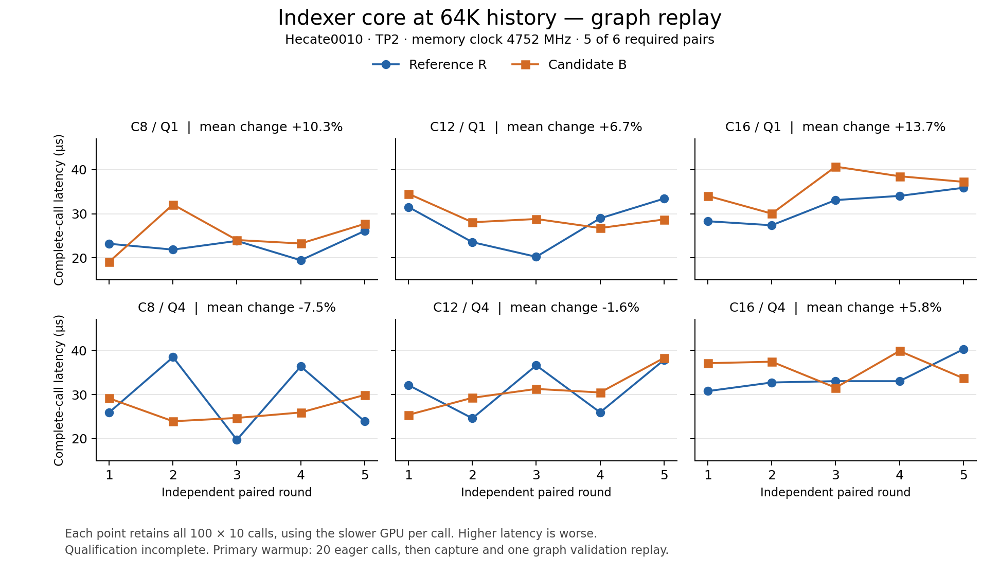

# ICP consolidation: human review, 2026-10-09

The corrected sources and final Hecate validation evidence are published for
human review. **Performance retention and merge readiness are not established.**
Five of six module pairs completed with persistent slowdowns; the model decode
windows failed qualification. Earlier source refs remain unchanged. AI assistance
was used.

| Repository | Pinned upstream base | Review head |
| --- | --- | --- |
| MSA | vllm-project/MSA **dev**, `968061ab16cb14991a5c7d4c0e8eabf531be0dcf` | `cd20e206a3373e8d258da8cd403b4b3399b1f714` |
| vLLM | vllm-project/vllm main, `ab905a885dfbfc60a2c02286cc9c608c93884de3` | `19afac40273aa84c2693ca1083995c4156aca4e2` |

Both repositories use `review/icp-base-20261009` and
`review/icp-consolidation-20261009`. MSA's base is the requested dev branch.
The vLLM base is the pinned revision used for builds and validation; main has
subsequently advanced. No validated source was rebased during measurement.

| Repository | GitHub comparison | GitLab comparison |
| --- | --- | --- |
| MSA | [fans-nv/MSA](https://github.com/fans-nv/MSA/compare/review%2Ficp-base-20261009...review%2Ficp-consolidation-20261009) | [fans/MSA](https://gitlab-master.nvidia.com/fans/MSA/-/compare/review%2Ficp-base-20261009...review%2Ficp-consolidation-20261009) |
| vLLM | [fans-nv/vllm](https://github.com/fans-nv/vllm/compare/review%2Ficp-base-20261009...review%2Ficp-consolidation-20261009) | [fans/vllm](https://gitlab-master.nvidia.com/fans/vllm/-/compare/review%2Ficp-base-20261009...review%2Ficp-consolidation-20261009) |

Publication results and any incomplete destination are recorded in
[publication.json](publication.json). The comparisons contain 147 changed MSA
files (+38,871/−581 lines) and 52 changed vLLM files (+10,977/−198 lines),
including tests, packaging, documentation, and licenses. This remains a
substantial review; the final correctness repairs themselves are small.

## Components and final repairs

MSA owns the local indexer, candidate selection/merge, TP candidate transport,
device plans, and source-keyed prewarm/cache admission. Prefill scoring uses
MSA's shared FMHA implementation; sparse NVFP4 attention and decode adapters
reuse the shared MSA implementations. vLLM owns the existing fused QK-norm,
RoPE, and cache writer with an explicit ICP mode, plus the model and runtime
integration. There is no separate ICP writer binary in the public candidate.

The final MSA commit fixes an inherited four-stage decode scorer race: an
async-proxy fence orders shared-memory reads before the producer can reuse a
TMA stage. The unchanged inherited scorer failed exact standalone tests;
the fence-only variant passed. The committed regression covers long context,
both TP ranks, eager execution, and changed-query graph replay. A new source
key forces fresh corrected AOT artifacts.

The final vLLM commit restores the model-local dense FP8 policy when sparse
attention uses NVFP4. It passes a copied cache configuration to dense
attention; the sparse configuration and native inputs remain unchanged.
This resolves the first model boot's unsupported dense NVFP4 path on SM107.

The runtime changes expose the complete compound page to cache allocation,
binding and offload; keep graph metadata and plans bound to the current cache;
and drain/release owned transport resources during profiling, rebinding and
shutdown. Model-specific index-Q/K projection replication is explicit.

## Completed validation and its limits

Fresh native core, MoE, FlashAttention and supporting targets were built against
the unchanged Rubin CUDA 13.5/Torch/FlashInfer environment. Source, import and
native hashes were bound per arm; no old vLLM native binary was substituted.
Corrected controls are explicitly named `K_fixed`, `R_fixed` and `B_fixed`.

- Candidate correctness passed all 60 primary core cases: 36 decode and 24
  prefill/mixed, plus all 18 guards with clean process finalization. Decode
  includes exact TopK and changed-query graph replay on both TP ranks.
- R_fixed passed all 60 core cases. Its 18 guards passed every numerical check,
  but the process hit its 600-second limit during distributed shutdown; the
  numerical pass and operational timeout remain separate.
- Native writer checks, 34 writer-reader composition cases, two-rank transport,
  compound-page DMA/canary checks, and loaded first/later-layer signed-input
  producer/graph admission passed. These do not establish complete model
  offload/reload, prefix/COW/cancellation/reuse or soak coverage.
- Ordinary canonical MSA and pinned upstream dev produced bitwise-equal tested
  outputs from separate fresh builds, with all five independent CPU FP32 oracle
  checks passing. The original GPU-SDPA reference NaNs remain recorded.
- ICP-on model routes, Eagle3 routing, cache ownership/lifecycle and serving
  policy admission passed. The ordinary ICP-off model failure remains open.

The [kernel report](evidence/hecate-723744/kernels/KERNEL-VALIDATION-RESULTS.md)
and [final validation status](evidence/hecate-723744/VALIDATION-STATUS.md)
bind case identities, source revisions and limitations.

## Measured performance

Five of six required R_fixed/B_fixed module pairs completed all 216 cells per
arm: 36 decode shapes × three boundaries × eager/graph, at C8/C12/C16 and
varied history lengths. Every sample and outlier is retained. Each cell uses
100 samples of ten complete calls, taking the slower rank per call before
arithmetic averaging. All ten arms passed continuous 4752 MHz memory-clock
telemetry and owned-lock cleanup.

At C16/Q1/64K, core graph latency was **31.75 → 36.11 µs (+13.7%)**, slower in
all five pairs. C12/Q1/150K later-layer producer plus indexer graph was
**39.91 → 46.51 µs (+16.5%)**, also slower in every pair. The six-pair decision
is incomplete. Primary warmup used 20 uncaptured calls and one graph validation
replay, not 20 graph replay warmups; this qualification remains explicit.

Separate K/R/B CUPTI diagnostics completed 144 traces and 4,320 constituent
GPU kernels over 12 shapes, eager/graph, both ranks. Scoring, fused
selection/publication and merge/polling overlap through PDL; their durations
cannot be summed as serial latency. Large 150K outliers align with increased
rank-arrival skew, without establishing a cause or pure spin time. Communication
was same-node NVLink/symmetric-memory publication. No standalone bandwidth or
inter-node NIC latency/bandwidth was measured.

The whole-model sentinel completed one R/B pair at ISL65536/OSL1024,
C8/C12/C16, TP2/ICP2 and real Eagle3 k=3: 72 warmup plus 360 measured requests
per arm, zero request errors or preemptions. Descriptive whole-request output
throughput changed +0.29%, −0.29% and −0.92%. **All original pure-decode
scheduler windows failed**, leaving 1/6 collected pairs and zero accepted
pairs. A separately labeled post-hoc boundary diagnostic does not replace the
frozen metric. Observer overhead is unqualified. K/B primary module timing,
prefill/mixed timing and all 30 H/B primary model cells remain unmeasured.

See the [complete performance report](evidence/hecate-723744/PERFORMANCE-REPORT.md),
[model sentinel report](evidence/hecate-723744/analysis/model-decode-one-pair-r1/REPORT.md)
and [rank-skew analysis](evidence/hecate-723744/analysis/cupti-rank-skew-r1/REPORT.md).

## Accuracy

Two complete GSM8K pairs used 16 disjoint warmups and all 1,319 scored examples
per fresh boot, C16, zero-shot adaptive chat, temperature 0, top-p 1 and at
most 512 generated tokens. Independent rescoring retained the complete results.

| Paired round | Historical image | Corrected candidate | Candidate − historical |
| --- | ---: | ---: | ---: |
| 1 | 1260/1319 (95.5269%) | 1254/1319 (95.0720%) | −0.4549 percentage points |
| 2 | 1265/1319 (95.9060%) | 1261/1319 (95.6027%) | −0.3033 percentage points |

Mean paired difference: **−0.3791 percentage points**. Both candidate boots
exceeded 95%; two pairs do not establish equivalence. H has a different image,
attention backend and UGPU policy, so this is a whole-system comparison.
[Accuracy receipt](evidence/hecate-723744/analysis/accuracy-two-pairs-r1/result.json).

## Open before merge

The ordinary **ICP-off whole-model route remains failing** with a CUDA launch
error; its first failing GPU operation is not localized. The fresh-cache,
synchronous r2 diagnostic failed before model startup because its private
TMPDIR made a Unix IPC socket path too long. Supported `VLLM_RPC_BASE_PATH=/tmp`
was identified, but no final r3 retry packet was authored or launched. This
harness failure adds no kernel evidence and no production workaround was applied.

Remaining work includes ordinary-route compatibility, a complete and qualified
repeated performance protocol addressing warmup/window issues and persistent
slowdowns, K/B and prefill/mixed timing, clean R guard finalization, and broader
model lifecycle coverage. Six accepted model pairs remain required; the failed
first pair cannot count toward that acceptance. The
[follow-up plan](evidence/hecate-723744/FOLLOWUP-VALIDATION.md) records the
proposed complete protocol; it has not been executed.

All GPU work drained before allocation723744 naturally expired at 09:45:25 UTC.
Final checks found both nodes idle. Agents did not cancel, requeue or release
the allocation. The [execution record](evidence/hecate-723744/EXECUTION.md)
preserves actual commands, timeouts, cleanup and failed attempts.

Upstream submission remains pending the listed compatibility/performance checks
and the human review requested by the user. No upstream PR/MR was opened.

[MSA MR description](msa-mr-description.md) ·
[vLLM MR description](vllm-mr-description.md) ·
[Evidence snapshot](validation-snapshot.json) ·
[Copied artifact hashes](evidence/hecate-723744/MANIFEST.json)
